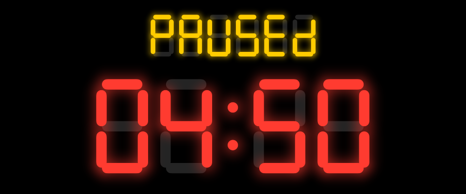
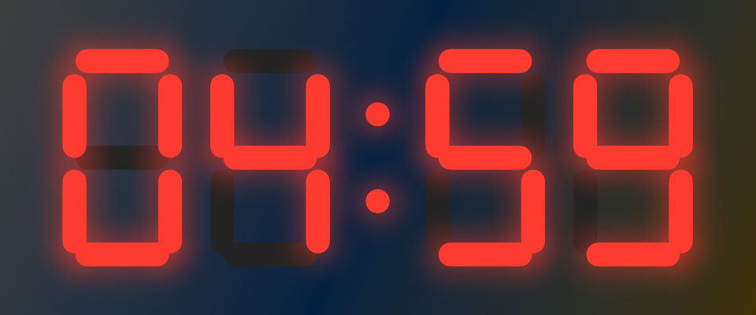

# LCD Timer

A countdown for the Mac that looks like a gym's wall clock: glowing seven-segment digits with the unlit segments
faintly there, drawn rather than typed, as big as the window.



- **Keyboard first.** Type `5` `0` `0` and Return for five minutes. Space pauses and resumes, Escape resets,
  Return with nothing typed runs the last time again.
- **Colour says the state.** White idle, red running, amber *PAUSEd*, red *donE* with a chime and a notification.
- **Stays out of the way.** ⌘P pins it on top of every window and Space, over a slightly translucent panel;
  ⌃⌘F makes the Mac a wall clock; close the window and the time left stays in the menu bar.
- **Always right.** The countdown keeps its end time, so sleep and a hidden window never make it drift.



## Build

Needs only the Command Line Tools and [`just`](https://github.com/casey/just).

```sh
just test   # host tests for TimerCore
just run    # builds "build/LCD Timer.app" and opens it
```

The spec is the [user stories](docs/stories/README.md); agent rules are in [AGENTS.md](AGENTS.md). The LED look
is ported from the Gym Timer in [context-grabber](https://github.com/idvorkin/context-grabber).
